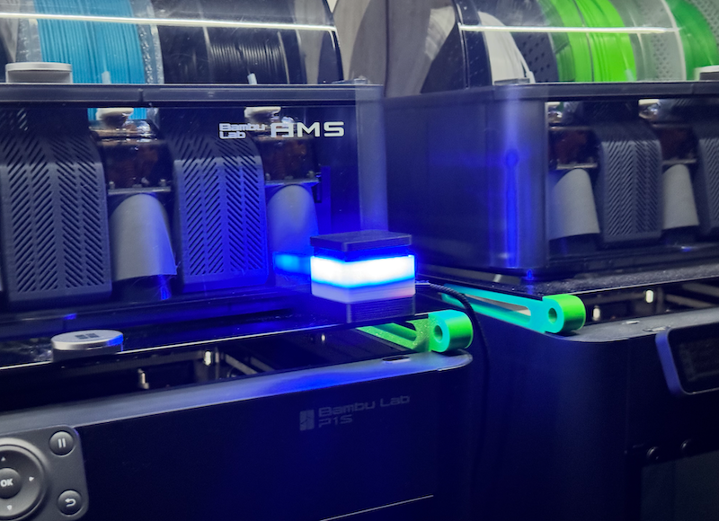
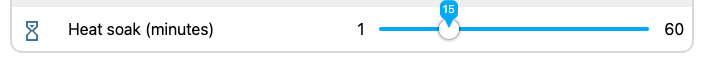

# PrintFarmButton
NOTE: This is a fork of Spencer's original PrintFarmButton project.
If you are looking to deloy to your farm visit his project directly: https://github.com/spuder/PrintFarmButton 



Main Differences:
1) Warming / Heat Soak function for materials other than PLA/TPU.
In the PrintFarmButton GUI you can now set a heat soak time, default is 15 minutes.
2) GUI Hanging/Freezeing with 5+ Printers.  
This was a buffer overload issue due to the response size being larger than 8kb, fixed.

### Printago States:  
🟦 - Idle  
🟨 - Downloading / Starting   
🟧 - Warming / heat soak (tap to skip)  
🟪 - Finished / Waiting for bed clear  
🟩 - Printing  
🟥 - Error

### Heat soak (machine start G-code)



Add this to your **printer machine start G-code** (Bambu Studio / Orca → Printer settings → Machine start G-code), after the bed reaches temperature.

Use `M400 U1` (wait for Resume), **not** `M400 S900` (timed dwell). Only a Resume pause can be skipped from the farm button.

There is **no timed wait in G-code** — the printer pauses until Resume. Soak duration is set on the button web UI (**Heat soak (minutes)**, default 15). Tap to skip early. Printago may show `0300-8013` (“paused by the user”); that is expected, not a fault.

PLA and TPU skip the pause; all other filaments (PETG, ABS, ASA, PC, etc.) heat-soak.

**Find**
```gcode
M190 S[bed_temperature_initial_layer_single] ; wait for bed temp
```
**Add Below**
```gcode
;===== Bed heat soak (start of print only) =====
; M400 U1 = wait for Resume (button tap, Printago, or printer UI).
; PrintFarmButton shows orange, auto-resumes after Heat soak (minutes), or skip early with a tap.
{if filament_type[initial_extruder]!="PLA" && filament_type[initial_extruder]!="TPU"}
M140 S[bed_temperature_initial_layer_single] ; hold bed at initial-layer temp
M400 U1 ; heat soak — resume to continue
{endif}
;===== Bed heat soak end =====
```

**How it works with the button**

1. Non-PLA/TPU job starts → bed heats → printer pauses on `M400 U1`
2. Button shows 🟧 orange (warming)
3. **Tap** the button to skip the soak and continue the print, **or** wait for **Heat soak (minutes)** and the button auto-sends Resume
4. Print continues → button shows 🟩 green

**Flashing Firmware**
Open the flash.html file in your browser and follow the onscreen options/instructions.
